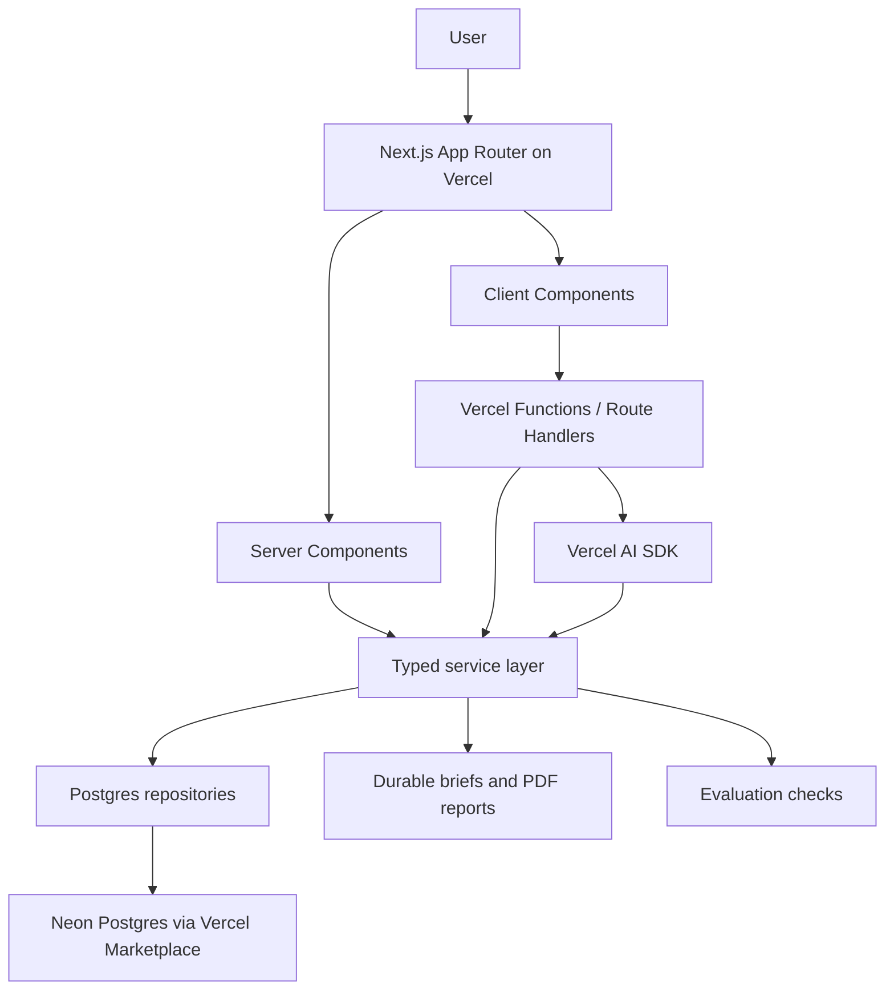

# PlacePulse Sentiment Intelligence Console

PlacePulse is a production-shaped sentiment intelligence console for exploring customer review sentiment across Australian suburbs, business categories and time periods.

It was built as a **Vercel Solutions Architect take-home assessment**. The goal was to build and deploy a small but realistic application on Vercel, then present the architecture and trade-offs as if speaking to a customer.

The project intentionally covers both assessment paths:

* **Frontend Cloud** — a dynamic analytics dashboard with server rendering, client-side interactivity, caching, revalidation and Core Web Vitals considerations.
* **AI Cloud** — a Vercel AI SDK-powered conversational analytics assistant with grounded tool use, generated briefs/reports and lightweight evaluation checks.

## Problem

Review and sentiment data is valuable, but it is often difficult for place-based teams to turn that data into decisions.

Local government, tourism, retail and precinct teams need to answer questions like:

* Which suburbs are improving or declining?
* Which business categories are creating the most customer friction?
* What themes are driving negative sentiment?
* Which review evidence supports the trend?
* Can an executive-ready brief be generated without manually reviewing hundreds of comments?

PlacePulse turns suburb-level sentiment data into a fast dashboard, conversational assistant and briefing workflow.

## Target users

The product is designed for:

* local government economic development teams
* destination and tourism organisations
* precinct managers
* retail and hospitality analysts
* executives who need clear place-performance summaries

## Product summary

The application allows users to:

* filter sentiment by suburb, category, aggregation type and month
* view satisfaction, rating, review volume and coverage KPIs
* inspect sentiment trends over time
* compare positive, negative and neutral sentiment
* review top themes and word-cloud terms
* inspect supporting review evidence
* ask natural-language questions about the selected suburb/category
* generate an AI-written sentiment brief
* export a PDF-style report
* run evaluation checks against AI answers and report generation behaviour

## Architecture



## Platform choices

### Vercel

The app is deployed on Vercel and uses Vercel-native patterns where appropriate:

* Next.js App Router
* Server Components for the initial dashboard view
* Client Components only where interactivity is required
* Route Handlers for API, AI and report generation endpoints
* Vercel Functions for server-side workloads
* Fluid Compute configuration for AI and report routes
* Vercel Analytics and Speed Insights for observability
* Vercel Marketplace Postgres integration through Neon
* Vercel AI SDK for conversational analytics and briefing
* optional Vercel Blob path for generated report storage

### Postgres / Neon

The sentiment dataset is hosted in Postgres/Neon.

The CSV/TSV import script is only an ingestion tool. It reads the source file and inserts rows into the deployed database. At runtime, the app does not read from local files.

Runtime path:

```txt
Dashboard or AI request
  ↓
Next.js Route Handler / Server Component
  ↓
sentimentService
  ↓
sentimentRepository
  ↓
Neon Postgres
  ↓
typed response
```

## Data model

The primary table is:

```txt
sentiment_area_category_month
```

It stores monthly suburb/category sentiment records including:

* area name
* category
* aggregation type
* month
* POI and review coverage
* average rating
* star-rating sentiment score
* review-text sentiment score
* overall satisfaction score
* positive / negative / neutral / unknown review counts
* percentage breakdowns
* rating-text conflict metrics
* theme JSON
* word-cloud JSON
* top-review evidence JSON

Supporting tables are used for:

* import jobs
* durable brief jobs
* chat sessions
* saved views
* evaluation runs
* audit events

## Rendering strategy

The app separates static, server-rendered and client-rendered work.

### Server-rendered

The dashboard shell and first sentiment view are rendered server-side so the page has useful content on first load.

This supports:

* faster perceived load
* stronger LCP
* lower client-side JavaScript
* stable layout before hydration
* better indexability for public report pages

### Client-rendered

Client Components are used where interactivity is required:

* dashboard filters
* charts
* assistant drawer
* brief generation actions
* dynamic table interactions

### Streaming and loading states

The app uses loading states and component boundaries so expensive sections can load progressively:

* dashboard shell first
* KPI cards early
* charts and evidence panels progressively
* AI responses streamed token-by-token through the Vercel AI SDK

## Caching strategy

The app uses layered caching.

### Database indexes

Postgres indexes support common access patterns:

* suburb + category + date
* category + date
* suburb + date
* aggregation type + date

### API caching

Read-heavy API routes return cache headers such as:

```txt
s-maxage=300, stale-while-revalidate=3600
```

This is suitable for sentiment analytics because the dataset is analytical and does not need second-by-second freshness.

### Next.js fetch caching

Frontend data requests are structured so dashboard reads can be cached and revalidated.

### Revalidation

The import flow can be paired with revalidation so fresh data becomes visible after imports complete.

## Core Web Vitals decisions

The UI is designed around the main Core Web Vitals concerns.

### LCP

* server-render the first dashboard state
* avoid blocking the first view with large client bundles
* keep the header and primary dashboard content lightweight
* progressively load deeper analytics panels

### CLS

* reserve space for charts and KPI cards
* use consistent card dimensions
* avoid layout shifts when filters and data load

### INP

* keep filters lightweight
* avoid pushing all chart/report logic into the client
* use server-side aggregation where possible
* isolate expensive client interactions

## AI features

PlacePulse includes an AI assistant for conversational analytics.

Example questions:

* “What is driving negative sentiment in Abbotsford?”
* “Summarise healthcare sentiment for this suburb.”
* “Which themes should the council prioritise?”
* “Generate an executive brief for this selected view.”
* “Compare this suburb against the category trend.”

The assistant is grounded in backend sentiment data. It does not answer from memory alone.

## Vercel AI SDK

The AI layer uses the Vercel AI SDK for:

* streaming chat responses
* typed tool calling
* structured report generation
* reusable model configuration
* fallback-ready model routing
* evaluation support

Core files:

```txt
lib/ai/model.ts
lib/ai/prompt.ts
lib/ai/tools.ts
app/api/chat/route.ts
app/api/briefs/route.ts
```

The assistant uses tools such as:

* get sentiment dashboard context
* get available filters
* get suburb/category trend
* get supporting review evidence
* generate executive brief

## AI safety and grounding

The assistant is designed to:

* answer only from retrieved sentiment data
* reference the relevant suburb, category and time period
* distinguish evidence-backed findings from assumptions
* avoid inventing data where no record exists
* surface data coverage limitations
* avoid overclaiming where review coverage is low

## Evaluation approach

The app includes lightweight evaluation checks for the AI Cloud path.

Evaluation examples:

* groundedness check: answer must reference retrieved suburb/category/date data
* no-data check: assistant must not invent metrics when records are missing
* brief quality check: generated brief must include summary, drivers, risks and recommended actions
* tool-use check: assistant should call the sentiment tool before answering analytical questions
* regression check: known test prompts should continue to pass

Evaluation files:

```txt
lib/evals/cases.ts
lib/evals/runEvalCase.ts
scripts/run-evals.ts
app/evals/page.tsx
```

Run evals with:

```bash
npm run evals
```

## Tech stack

* Next.js App Router
* React
* TypeScript
* Tailwind CSS
* Vercel
* Vercel Functions
* Vercel AI SDK
* Neon Postgres
* Postgres.js
* Zod
* csv-parse
* Recharts
* React PDF Renderer
* Vercel Analytics
* Vercel Speed Insights

## Project structure

```txt
app/
  api/
    chat/
      route.ts
    sentiment/
      route.ts
    filters/
      route.ts
    briefs/
      route.ts
    reports/
      [id]/
        route.ts
  briefs/
    [id]/
      page.tsx
  evals/
    page.tsx
  layout.tsx
  page.tsx

components/
  ai/
    SentimentAssistant.tsx
  dashboard/
    DashboardShell.tsx
    FilterBar.tsx
    KpiCards.tsx
    SentimentTrendChart.tsx
    ThemePanel.tsx
    WordCloudPanel.tsx
    ReviewEvidencePanel.tsx
    DataQualityPanel.tsx
  reports/
    SentimentReportDocument.tsx
  ui/
    Card.tsx
    Button.tsx
    Badge.tsx
    Skeleton.tsx

lib/
  ai/
    model.ts
    prompt.ts
    tools.ts
  db/
    client.ts
    schema.sql
  evals/
    cases.ts
    runEvalCase.ts
  repositories/
    sentimentRepository.ts
    briefRepository.ts
  services/
    sentimentService.ts
    briefingService.ts
    reportService.ts
  types.ts
  validation.ts

scripts/
  migrate.ts
  import-sentiment-data.ts
  run-evals.ts
```

## Getting started

### 1. Install dependencies

```bash
npm install
```

### 2. Create local environment file

```bash
cp .env.example .env.local
```

### 3. Configure environment variables

Required:

```env
DATABASE_URL=
OPENAI_API_KEY=
```

Optional:

```env
BLOB_READ_WRITE_TOKEN=
NEXT_PUBLIC_APP_ENV=development
NEXT_PUBLIC_ENABLE_ARCHITECTURE_PANEL=true
EVALS_REQUIRE_PASS=false
```

### 4. Pull environment variables from Vercel

After the project is connected to Vercel and Neon:

```bash
vercel env pull .env.local
```

### 5. Run database migration

```bash
npm run db:migrate
```

### 6. Import sentiment data

```bash
npm run import:sentiment -- ./data/sentiment_full.csv
```

Local data files are ignored and should not be committed.

### 7. Run locally

```bash
npm run dev
```

Open:

```txt
http://localhost:3000
```

## Scripts

```json
{
  "dev": "next dev",
  "build": "next build",
  "start": "next start",
  "lint": "next lint",
  "db:migrate": "tsx scripts/migrate.ts",
  "import:sentiment": "tsx scripts/import-sentiment-data.ts",
  "evals": "tsx scripts/run-evals.ts"
}
```

## Deployment

The app is deployed on Vercel.

Recommended environments:

```txt
main      → production
staging   → preview/staging
feature/* → preview deployments
```

Deployment flow:

```bash
git checkout staging
git push origin staging
```

Open the Vercel Preview Deployment and verify:

* dashboard loads
* filters work
* API routes return data
* AI assistant streams a response
* brief generation completes
* eval page loads

Then merge to main:

```bash
git checkout main
git merge staging
git push origin main
```

## Demo

The app demonstrates:

* a server-rendered analytics dashboard
* cached sentiment API routes
* Postgres-backed sentiment data
* conversational analytics using the Vercel AI SDK
* generated sentiment briefs and PDF reports
* lightweight AI evaluation checks
* Vercel deployment, environment configuration and production-style service boundaries

## Production considerations

A full production version would add:

* authentication and organisation workspaces
* role-based access controls
* row-level access policies
* scheduled import jobs
* automated data-quality checks before publish
* saved dashboard views
* shareable public reports
* Vercel Blob storage for generated reports
* AI Gateway observability and provider fallback
* model cost tracking
* rate limiting
* monitoring and alerting
* expanded evaluation test suite
* multi-region performance testing

## Roadmap

Planned extensions:

* authentication and organisation workspaces
* role-based access controls
* scheduled data imports
* automated data-quality checks before publish
* saved dashboard views
* shareable public reports
* AI Gateway observability and provider fallback
* expanded evaluation test suite
* report storage with Vercel Blob
* usage analytics and cost monitoring
* multi-region performance testing

## Why this project exists

PlacePulse is designed to show how sentiment intelligence can move from raw review data to operational decision-making.

The product focuses on three outcomes:

1. **Faster analysis** — users can move from suburb/category filters to sentiment drivers quickly.
2. **Evidence-backed reporting** — every summary is linked back to metrics, themes and review evidence.
3. **AI-assisted workflows** — the assistant and brief generator reduce manual analysis without bypassing the underlying data.

## License

This project is for demonstration and portfolio purposes only, feel free to rip out whatever you want from it should it help you out!
