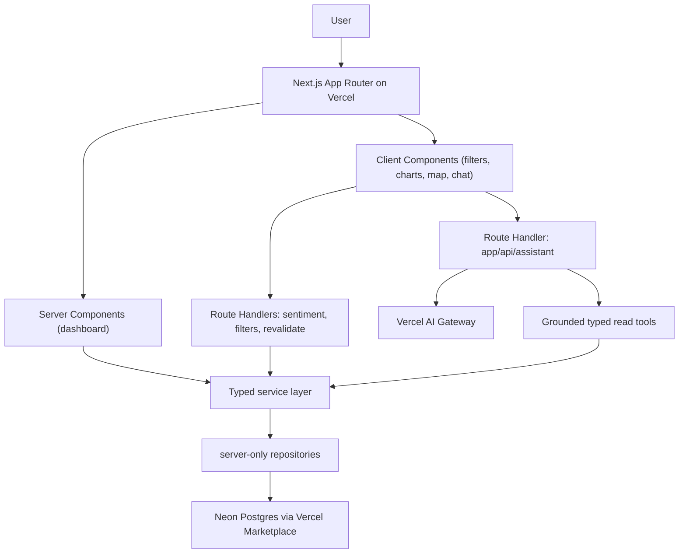

# PlacePulse Sentiment Intelligence Console

PlacePulse is a production-shaped sentiment intelligence console for exploring customer review sentiment across Queensland suburbs, business categories and time periods.

It was built as a **Vercel Solutions Architect take-home assessment**. The goal was to build and deploy a small but realistic application on Vercel, then present the architecture and trade-offs as if speaking to a customer.

The project intentionally covers both assessment paths:

* **Frontend Cloud**: a dynamic analytics dashboard with server rendering, client-side interactivity, caching, revalidation and Core Web Vitals discipline.
* **AI Cloud**: a Vercel AI SDK assistant with grounded tool use over the live data, generative tool cards, durable AI-generated PDF briefs, and grounding evals.

> **Reviewer access:** the deployed app is sign-in gated with Clerk. Create an account on the deployed URL (development instance, any email works) to explore every surface. The Clerk development instance is a deliberate choice for review: it lets any reviewer self-serve a sign-in with no allow-listing, where a production instance would require a custom domain with DNS-verified Clerk subdomains. Swapping to production is a keys-and-DNS change, not a code change.

## Business value

PlacePulse is built for place-based teams — local government, tourism bodies, precinct and multi-site operators — who have to act on customer sentiment across Queensland suburbs but live in the gap between a flood of Google reviews and a defensible decision.

Today that gap is closed by hand: pulling reviews, pivoting spreadsheets, and arguing over which numbers are real. PlacePulse turns those reviews into a fast, filterable dashboard and a grounded assistant, so an analyst goes from days in spreadsheets to answers in minutes.

Every AI figure is auditable back to the underlying review data through the tool-call timeline, so the answer is defensible, not just plausible. Chat can drive the dashboard filters and ship a ready-to-send PDF brief, moving a team from question to evidence to deliverable in one pass.

## Current status

Built commit by commit. Every core surface is now built:

| Surface | Status | Notes |
| --- | --- | --- |
| Dashboard (`/`) | Built | KPIs, three-year trend, category breakdown, theme drivers, word cloud, distributions, suburb boundary map. |
| Assistant (docked copilot) | Built | Streaming grounded chat that can drive the dashboard filters by chat; generative tool cards over an audit timeline. |
| Assistant (full-screen page, `/assistant`) | Built | Same engine with per-user, resumable conversation threads. |
| Briefs (`/briefs`) | Built | Durable AI-generated PDF briefs in four types (overview, suburb comparison, category deep-dive, momentum); suburbs chosen on a map. |
| Evals | Built | Grounding suite across every tool tier plus refusal and dashboard-action cases, with an independent LLM faithfulness judge; stored in `eval_runs`, runnable via `npm run evals` (or `ci:full`). |
| Places explorer (`/places`) | Built | Queensland business directory, place detail slide-overs with imagery, and a clustered point map over the POI dataset. |
| Auth | Built | Clerk via the Vercel Marketplace; the app is sign-in gated and AI/brief data is scoped per user. |

The build plan lives in `docs/ai-cloud-plan.md`, the architecture narrative in `docs/architecture-overview.md`, and the commit-level reasoning in `docs/architecture-decisions.md`.

## Problem

Review and sentiment data is valuable, but it is often difficult for place-based teams to turn that data into decisions.

Local government, tourism, retail and precinct teams need to answer questions like:

* Which suburbs are improving or declining?
* Which business categories are creating the most customer friction?
* What themes are driving negative sentiment?
* Which review evidence supports the trend?

PlacePulse turns suburb-level sentiment data into a fast dashboard and a grounded conversational assistant, with executive PDF briefs and place-level exploration alongside.

## Target users

* local government economic development teams
* destination and tourism organisations
* precinct managers
* retail and hospitality analysts
* executives who need clear place-performance summaries

## Product summary

The application lets users:

* filter suburb sentiment by suburb and category, with the latest month as the snapshot and a three-year trend
* view satisfaction, rating, review-volume and year-on-year KPIs, theme drivers, a word cloud, and star and label distributions
* select a suburb visually from a Queensland boundary map
* ask natural-language questions about suburb sentiment, the themes behind it, and specific places and their review quotes, answered only from the data, with the assistant able to drive the dashboard filters by chat
* resume past assistant conversations as threads on the full-screen `/assistant` page
* generate durable executive PDF briefs in four report types, choosing the suburbs on a map
* explore the Queensland places directory, with place detail (imagery, themes, real reviews) and a clustered point map

## The two datasets

PlacePulse layers two datasets at two grains rather than merging them:

```txt
sentiment_suburbs   suburb x category x month aggregates
                    -> the dashboard, and the assistant's suburb tools

poi_* (about 27M    individual Queensland businesses, reviews, themes and words
rows)               -> the assistant's place tools, and the Places explorer
```

The dashboard answers "what" (aggregate and visual). The place data answers "why and show me" (real businesses and real review quotes) through the assistant. The whole product is scoped to Queensland, because the place data is Queensland only.

## Architecture



## Platform choices

### Vercel

The app is deployed on Vercel and uses Vercel-native patterns:

* Next.js App Router (one deployment, no front-end and back-end split)
* Server Components for the initial dashboard view
* Client Components only where interactivity is required (filters, charts, map, chat)
* Route Handlers for the sentiment APIs and the streaming assistant
* Fluid Compute for the assistant route, so an interactive endpoint stays warm between turns
* the **Vercel AI Gateway** for model access, addressed by `provider/model` slug, with OIDC auth on Vercel and an `AI_GATEWAY_API_KEY` for local development
* Vercel Marketplace Postgres through Neon
* **Vercel Blob** to store the generated brief PDFs
* **Clerk via the Vercel Marketplace** for authentication, with `proxy.ts` (the Next 16 middleware convention, Node runtime) gating the app and the AI write routes
* `after()` to run the slow brief generation off the response path so the render never blocks the request
* per-user rate limiting on the two money-spending endpoints (the assistant and brief generation), so a signed-in user cannot spam expensive model calls
* observability through Vercel Analytics and Speed Insights for Core Web Vitals, the AI Gateway dashboard for model traffic, latency and cost, and the `eval_runs` table for grounding history

The Queensland boundary GeoJSON is a static asset served from the CDN (pointed at by an environment variable), not the app bundle.

### Postgres / Neon

The sentiment and place datasets are hosted in Neon Postgres. The app reads through the HTTP driver (`@neondatabase/serverless`) in a `server-only` repository, service and component layering. The import scripts are ingestion tools only: at runtime the app does not read from local files.

Runtime path:

```txt
Dashboard or assistant request
  -> Next.js Route Handler or Server Component
  -> sentimentService (or a grounded assistant tool)
  -> sentimentRepository / poiRepository
  -> Neon Postgres
  -> typed response
```

## Data model

The dashboard reads the suburb aggregate:

```txt
sentiment_suburbs
```

Each row is a suburb, category, granularity and month with average rating, a 0 to 100 satisfaction score, review volume, positive / negative / neutral breakdowns, and JSON columns for theme sentiment, the word cloud and top review evidence. The app is scoped to Queensland through a `qld_suburbs` reference built from the place data (see `lib/db/qld-suburbs.sql`).

The place-level dataset lives in the `poi_*` landing tables (places, reviews, review scores, themes, theme hits and word terms), loaded from a gzipped CSV export with a streaming COPY loader.

Supporting tables: `chat_sessions`, `brief_jobs`, `eval_runs`, `import_jobs`, `audit_events`.

## Rendering strategy

### Server-rendered

The dashboard shell and the first sentiment view render server-side so the page has useful content on first load. This supports faster perceived load, stronger LCP, lower client JavaScript and a stable layout before hydration.

### Client-rendered

Client Components are used only where interactivity is required: the filter bar, the ECharts and ApexCharts visualisations, the Mapbox suburb map, and the assistant chat. Heavy libraries are code-split with `next/dynamic` so they stay out of the dashboard's first load, and the map mounts only when its drawer opens.

### Streaming

The assistant streams token by token over a Route Handler using the Vercel AI SDK, and `app/loading.tsx` streams a dashboard skeleton while the first slice resolves.

## Caching strategy

* **Database indexes** support the common access patterns (suburb plus category plus date, category plus date, suburb plus date, granularity plus date).
* **API caching**: read-heavy sentiment routes return `s-maxage` with `stale-while-revalidate`, suitable because the data is analytical and does not need second-by-second freshness.
* **Revalidation**: the import flow can be paired with on-demand revalidation so fresh data becomes visible after an import.

## Core Web Vitals decisions

* **LCP**: server-render the first dashboard state, keep the header and primary content lightweight, and progressively load deeper panels.
* **CLS**: reserve space for charts and KPI cards, and use consistent card dimensions.
* **INP**: keep filters lightweight, keep aggregation server-side, and code-split expensive client interactions (charts, map, chat).

## AI features

PlacePulse includes a grounded conversational assistant, mounted as a docked copilot on the dashboard and as a full-screen workspace at `/assistant` with resumable per-user threads.

Example questions:

* "How satisfied are visitors with Brisbane City?"
* "What is driving negative reviews in Surfers Paradise?"
* "Compare Fortitude Valley and South Brisbane."
* "What do people say about cafes in Fortitude Valley?"

The assistant answers only from tool output. It does not answer from memory and cannot write SQL.

### How the assistant works

* **Model access** through the Vercel AI Gateway, configured in one place (`lib/ai/model.ts`) as a per-role map of a primary and a fallback model. The assistant runs on `anthropic/claude-sonnet-4-6` (strong tool use at interactive latency) and falls back to Haiku 4.5; briefs and the eval judge run on Opus 4.8 (long-form quality, off the interactive path) and fall back to Sonnet. Selecting or swapping a model is a one-line change, never a call-site edit.
* **Fallback and retries**: transient upstream errors are retried (`MAX_RETRIES`); on a hard primary-model failure, the non-streaming calls (briefs, judge) fall back to the role's secondary model via `withModelFallback`, so a model outage degrades gracefully rather than failing the request.
* **A streaming Route Handler** (`app/api/assistant/route.ts`) runs `streamText` with a bounded multi-step tool loop, a per-user rate limit, and returns the UI-message stream that the client consumes.
* **Grounded typed tools** (`lib/assistant/tools.ts`): zod-validated read tools over the same service and repository layers the dashboard uses, so the model can only surface figures that already exist in Neon. Suburb tools cover sentiment, trend, drivers, category breakdown and comparison; place tools cover individual businesses, their themes and real review quotes.
* **A grounding contract** (`lib/assistant/systemPrompt.ts`): answer only from tool results, name the figure and the suburb or place it came from, and never invent a number, suburb or business.
* **Persistence** (`lib/assistant/sessions.ts`): each completed turn is written to `chat_sessions` after the response is delivered, so the write never sits on the response path.
* **Rendering**: assistant markdown (including tables) renders with **Streamdown**, and a tool-call timeline shows each tool, its input and its output so every answer is auditable.
* **Generative UI**: tool results also render as rich cards (suburb KPIs, an SVG trend sparkline, place cards with locator maps, a head-to-head compare) above the audit timeline.
* **Driving the product**: a `setDashboardFilter` tool returns a typed action the dashboard applies to its URL filters, so a chat turn changes what the dashboard shows.
* **Threads**: the full-screen page lists and resumes past conversations (`useChat` id plus stored messages), scoped per user. The dashboard dock stays contextual and out of that saved thread list, but persists its conversation within the browser session, so navigating to a place detail and back does not lose context, and it can be restarted from its header.

### Briefs

`/briefs` generates executive PDF briefs in four report types over one pipeline: a schema-constrained `generateObject` call on Opus 4.8 (with fallback to Sonnet) drafts the prose, `@react-pdf/renderer` renders the document, the PDF is stored in Vercel Blob, and the job is recorded in `brief_jobs`. Generation runs off the response path via `after()`, the endpoint is rate-limited per user, and the page polls the job to completion. The four types (overview, suburb comparison, category deep-dive, momentum) are a discriminated union over the shared runner, each with its own content schema and template. Suburbs are chosen on a map, with a satisfaction choropleth for the category deep-dive.

### Evals

`npm run evals` runs a grounding suite (`lib/evals/*`) against the live assistant path (real model, real tools): it spans every tool tier (suburb, place, dashboard-action) and asserts the right tool is called, the cited figures match the data, real entities are used, dashboard-drive requests actually apply, and both out-of-coverage and out-of-scope ("write a review") requests decline. The synthesis-heavy cases are additionally graded by an independent **LLM faithfulness judge** running on a stronger model than the assistant (Opus judging Sonnet), so no model is the sole judge of its own output. Each run is recorded in `eval_runs`. Evals are kept out of the default `ci` script (so CI makes no paid model calls) and run on demand or via `ci:full`; set `EVALS_REQUIRE_PASS=true` to gate a pipeline on them.

## Tech stack

* Next.js App Router (Turbopack), React 19, TypeScript
* Tailwind CSS v4, lucide-react icons
* Vercel, Vercel Functions (Fluid Compute), Vercel AI Gateway, Vercel Blob, Clerk auth (Vercel Marketplace)
* Vercel AI SDK (`ai` and `@ai-sdk/react`) with Streamdown
* Neon Postgres (`@neondatabase/serverless` HTTP driver); `pg` and `pg-copy-streams` for the bulk loader
* Zod for validation, `csv-parse` for ingestion
* ECharts and ApexCharts for visualisations
* Mapbox GL, Turf and Terraformer for the suburb map
* React PDF Renderer for the AI-generated brief PDFs
* Vercel Analytics and Speed Insights

## Project structure

```txt
app/
  api/
    assistant/route.ts        streaming assistant endpoint (rate-limited)
    assistant/threads/        per-user thread list and resume
    briefs/route.ts           brief generation jobs (rate-limited)
    sentiment/route.ts        sentiment slice
    sentiment/trend/route.ts  trend series
    sentiment/compare/route.ts
    sentiment/category-rank/route.ts
    places/                   point and suburb endpoints for the explorer
    filters/route.ts          filter catalogue
    revalidate/route.ts       on-demand revalidation
  assistant/page.tsx          full-screen assistant with threads
  briefs/page.tsx             brief builder with map selection
  places/                     places explorer and detail slide-overs
  layout.tsx
  loading.tsx
  page.tsx                    the dashboard

components/
  ai/
    AssistantChat.tsx         shared chat (useChat, streaming, composer)
    AssistantDock.tsx         docked copilot with a maximize toggle
    ToolCallView.tsx          the tool-call audit timeline
  dashboard/                  filter bar, KPIs, charts, drivers, word cloud, map
  shell/AppShell.tsx          sidebar shell
  ui/                         Card, Button, Badge, Skeleton, Spinner

lib/
  ai/model.ts                 Gateway-backed per-role models, fallback + retries
  ratelimit.ts                per-user limiter for the AI endpoints
  assistant/
    tools.ts                  grounded typed read tools
    systemPrompt.ts           the grounding contract
    sessions.ts               chat_sessions persistence
  briefs/                     brief pipeline, schemas and PDF templates
  evals/                      grounding suite, cases and LLM judge
  db/
    client.ts                 Neon HTTP client
    schema.sql                aggregate and supporting tables
    poi-schema.sql            POI landing tables
    poi-indexes.sql
    qld-suburbs.sql           Queensland scoping
  repositories/               sentimentRepository, poiRepository
  services/sentimentService.ts
  validation/sentiment.ts
  filters.ts, types.ts, ui/sentiment.ts, cache/cacheKeys.ts

scripts/
  migrate.ts                  apply schema
  import-sentiment-data.ts    load the suburb aggregate
  import-poi-data.ts          stream the POI export into Neon
  build-suburb-boundaries.mjs build the Queensland boundary GeoJSON
```

## Getting started

### 1. Install dependencies

```bash
npm install
```

### 2. Create a local environment file

```bash
cp .env.example .env.local
```

### 3. Configure environment variables

Required to run the dashboard:

```env
DATABASE_URL=
NEXT_PUBLIC_MAPBOX_TOKEN=
NEXT_PUBLIC_SUBURB_GEOJSON_URL=
```

Required for the assistant:

```env
AI_GATEWAY_API_KEY=
```

Required for authentication (Clerk):

```env
NEXT_PUBLIC_CLERK_PUBLISHABLE_KEY=
CLERK_SECRET_KEY=
```

Optional:

```env
NEXT_PUBLIC_APP_ENV=development
NEXT_PUBLIC_ENABLE_ARCHITECTURE_PANEL=true
EVALS_REQUIRE_PASS=false
SUBURB_BOUNDARY_GEOJSON_URL=
```

`NEXT_PUBLIC_*` values are inlined at build time, so set them before building and restart the dev server after changing them. On Vercel the AI Gateway authenticates with the project's OIDC token, so `AI_GATEWAY_API_KEY` is only needed locally.

Note: `vercel env pull` overwrites `.env.local` and returns blank values for variables marked sensitive on Vercel. Pull into a separate file (`vercel env pull /tmp/x.env`) and copy across what you need, rather than letting it target `.env.local`.

### 4. Run the database migration

```bash
npm run db:migrate
```

### 5. Import data

```bash
npm run import:sentiment -- ./data/sentiment.csv   # the suburb aggregate
tsx scripts/import-poi-data.ts                     # the Queensland POI dataset
```

Local data files are ignored and should not be committed.

### 6. Run locally

```bash
npm run dev
```

Open `http://localhost:3000`.

## Scripts

```json
{
  "dev": "next dev",
  "build": "next build",
  "start": "next start",
  "lint": "eslint",
  "typecheck": "tsc --noEmit",
  "db:migrate": "tsx scripts/migrate.ts",
  "import:sentiment": "tsx scripts/import-sentiment-data.ts",
  "evals": "tsx scripts/run-evals.ts",
  "ci": "npm run typecheck && npm run lint && npm run build",
  "ci:full": "npm run typecheck && npm run lint && npm run evals && npm run build"
}
```

The `evals` script runs the grounding suite in `lib/evals/*` against the assistant tools and records each run in `eval_runs`. The default `ci` script deliberately excludes evals so it makes no paid model calls; `ci:full` adds them for a pre-submission or release check.

## Deployment

The app is deployed on Vercel.

```txt
main      -> production
staging   -> preview/staging
feature/* -> preview deployments
```

After a deploy, verify in the Vercel preview or production URL:

* the dashboard loads and opens on a Queensland suburb
* filters and the suburb map work
* the sentiment API routes return data
* the assistant streams a grounded answer

## Why this project exists

PlacePulse is designed to show how sentiment intelligence can move from raw review data to operational decision-making, on Vercel-native primitives. It focuses on three outcomes:

1. **Faster analysis**: move from suburb and category filters to sentiment drivers quickly.
2. **Evidence-backed answers**: every assistant figure is read from a tool over the real data, with an audit timeline to prove it.
3. **AI-assisted workflows**: the assistant and the PDF briefs reduce manual analysis without bypassing the underlying data.

## License

This project is for demonstration and portfolio purposes only. Feel free to reuse whatever helps you.
